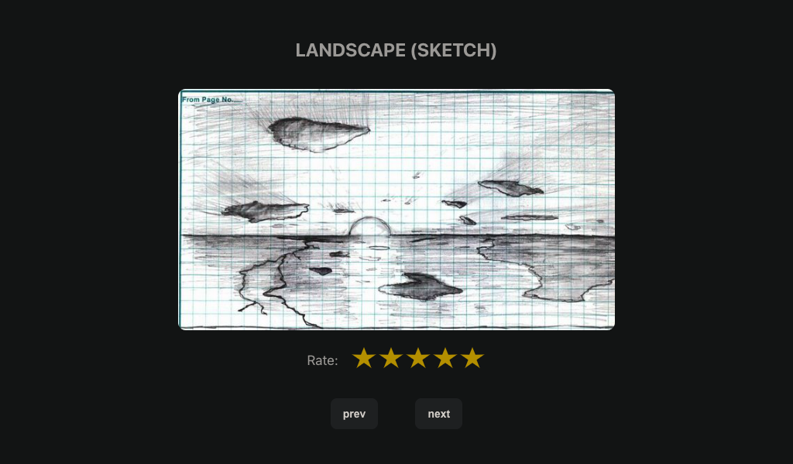

# comic_masiv

Masiv technical test.

<div style="display:flex; align-items:center; gap:3rem; margin: 2rem auto;">
  
  
</div>

## Project Setup

```sh
# install dependencies
yarn

# config environment (place the values of the provided keys)
mv .env.example .env.local
```

### Compile and Hot-Reload for Development

```sh
yarn dev
```

### Type-Check, Compile and Minify for Production

```sh
yarn build
```

### Run Unit Tests with [Vitest](https://vitest.dev/)

```sh
yarn test:unit
```

### Run End-to-End Tests with [Playwright](https://playwright.dev)

```sh
# Install browsers for the first run
npx playwright install

# When testing on CI, must build the project first
yarn build

# Runs the end-to-end tests
yarn test:e2e
# Runs the tests only on Chromium
yarn test:e2e -- --project=chromium
# Runs the tests of a specific file
yarn test:e2e -- tests/example.spec.ts
# Runs the tests in debug mode
yarn test:e2e -- --debug
```

### Lint with [ESLint](https://eslint.org/)

```sh
yarn lint
```
